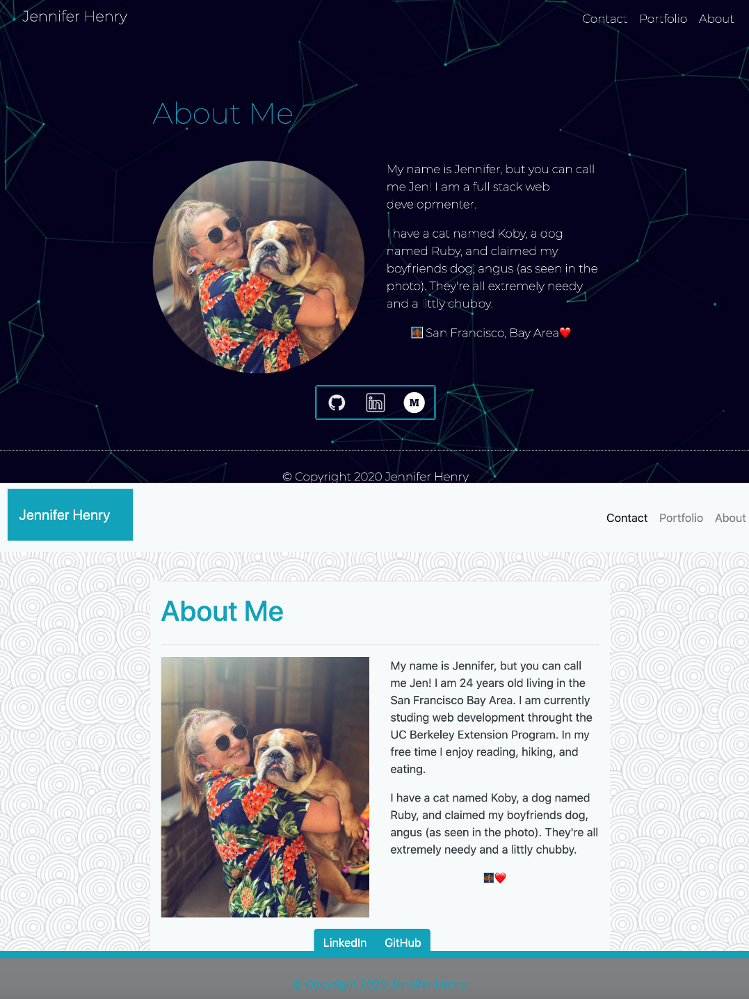
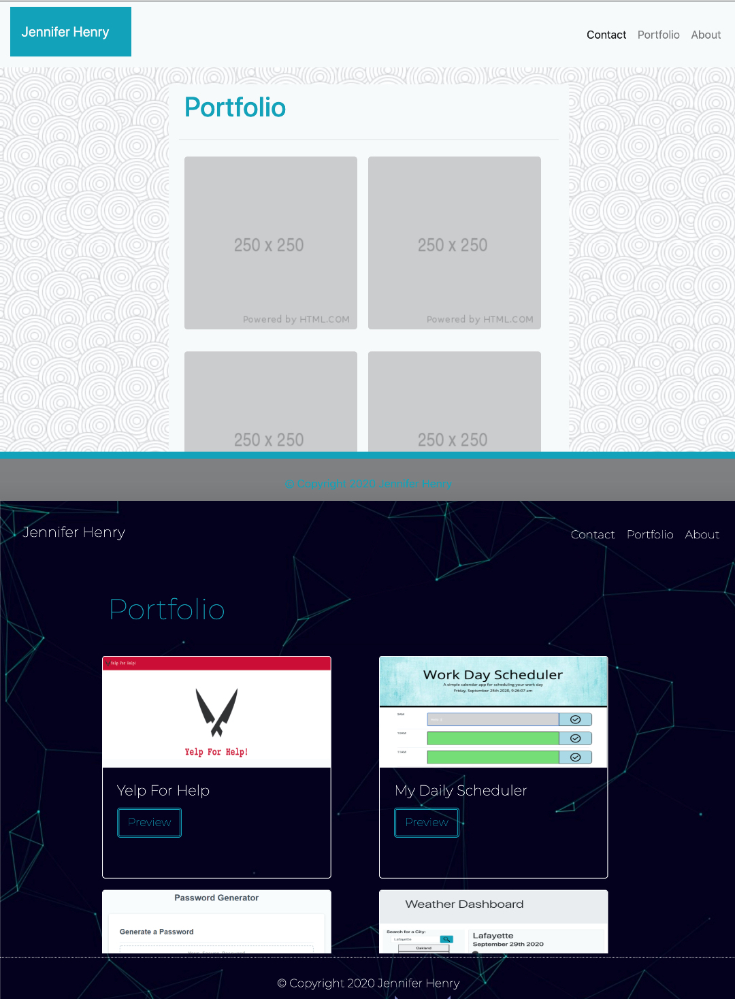
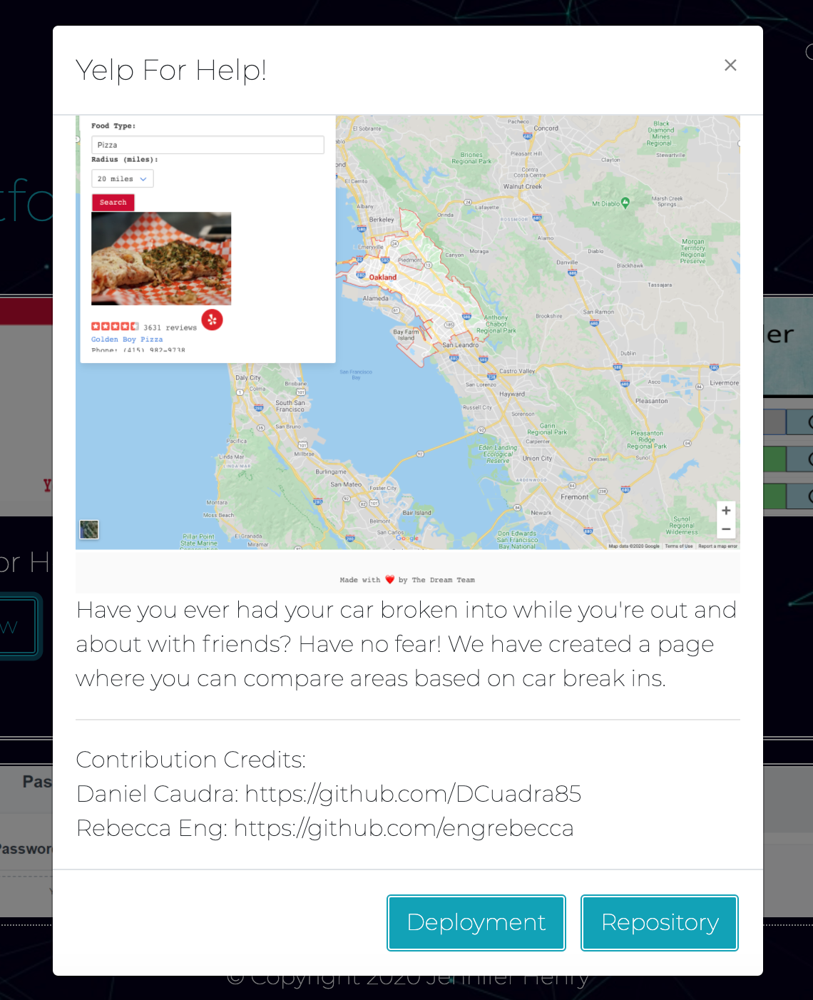

# Responsive Portfolio


## Installation

Deployment: 

https://jenryhennifer.github.io/responsive_portfolio/

Repository: 

https://github.com/jenryhennifer/responsive_portfolio

<hr />

## Technologies
* HTML
* CSS
* Bootstrap 
* GitLab 
* Github
* JQUERY
* JavaScript

<hr />

## Sample Images

UPDATED 2020.10.07




<hr />

##  Description


This webpage is my first attempt at my portfolio using [Bootstrap](https://getbootstrap.com/). Instead of using media queries, I used styling from Bootstrap to allow the page to be reactive. This is my first attempt at using bootstrap to make a successful, responsive, webpage. The navigation bar at the top is interactive and will guide you to one of 3 pages:

       1.Contact Me
       2.Portfolio
       3.About Me

I started by hand drawing out what my pages would look like to fully understand each element, columns, and rows.I searched Bootstrap for the elements I needed. 

The first element I attempted was the Navigation Bar and making sure it is the same on every page, while ensuring the elements to be clickable to allow the user to be able to navigate across all 3 pages using `<href>`. 

The next element I attmepted was the Contact Me page. I used `<form>` samples from Bootstrap. I used a card template from bootstrap to group the form in an even container. This space includes an input for a name, email, and message, including a submit button. Unfortunatly, as of now (09/16/2020), the submit button is not functioning.

The third element I attempted was the About Me page. This was a simple container with one row containting `<h1>` for the title, a second row containging 2 `<col-md-6>` to allow even spacing between the image and the text within the container, and finally a 3rd row containing 2 ~clickable~ buttons that will take you to either my linkedIn or GitHub pages. See Code Below:
```
<div class="btn-group" role="group" aria-label="Basic example">
    <a type="application/xml" class="btn btn-info" target='_blank' href= "https://www.linkedin.com/in/jennifer-henry-4a540a149/">LinkedIn</a>
    <a type="application/xml" class="btn btn-info" target="_blank" href="https://github.com/jenryhennifer">GitHub</a>
</div>
```

The fourth element I attempted was the Portfolio. The formatting of the container was a little complicated since I wanted to make two columns originally. I settled on no columns and placing all the images in one row and making them reactive to the screensize using `mx-auto` to set the margins left and right to auto.

The final element I attempted was the Footer. This was the most challenging part to my project. I was creating a sticky footer to stay to the bottom of the page even when scrolling. See code:
```
<footer class = 'page-footer font-small fixed-bottom text-info' style = "background-color:gray;">
  <div class = 'stickyfooter text-center' style= 'border-top: 10px solid'>
        <p class='footer-block'>© Copyright 2020 Jennifer Henry</p>
  </div>
</footer>
```

UPDATED 2020.10.07

The contact me form is now fully functional to send an email. When the submit button is clicked, the user's default email on their computer will automatically open with my email at the top, their name and subject inside the subject line, and the message they wrote inside the message of the email; all ready to click send. See below for the on click jQuery function:

```
$('#emailSubmit').on('click', function(event){
    event.preventDefault();
    let name = $('#userName').val();
    let subjectLine = $('#subjectLine').val();
    let message = $('#message').val();
    let subject = name + ': ' + subjectLine


    document.location = 'mailto:jenhenry1995@gmail.com?subject='+subject+'&body='+message + name;
});
```

A click feature was added with jQuery onto the modals to access both the github repo and the deployment for each assignment in the portfolio. The modals include an image and short description of each project. This will be updated as I continue my assingments.




```
$('#weatherDeploy').on('click', () => window.open('https://jenryhennifer.github.io/myWeatherApp/'))
$('#weatherRepo').on('click', () => window.open('https://github.com/jenryhennifer/myWeatherApp'))
```

Clearfix helped flexbox prevent odd floats with the cards. This group from CSS is a format for bootstrap clearfix:

```
@mixin clearfix() {
    &::after {
      display: block;
      content: "";
      clear: both;
    }
  }
```


<hr />

## Future Plans
I plan to make this more personalized as well as adding my future projects into 'portfolio'. I plan to allow the contact me form to be fully functioning. Since this is my first attempt, the colors will change in the future as well as abilities of the webpage by incrementing features I learn in the future.

I hope to use this one day for future employers to see my abilities, as well as, sample my future projects.

UPDATED 2020.10.07

I plan to make the page more interactive and update my about me (i'm not good about describing myself). I also plan to add an up to date resume once I have completed my class. I'm not too happy with my portfolio page and hope to make it look better later on.

<hr />

## License

MIT License

Copyright (c) 2020 Jennifer Henry

Permission is hereby granted, free of charge, to any person obtaining a copy of this software and associated documentation files (the "Software"), to deal in the Software without restriction, including without limitation the rights to use, copy, modify, merge, publish, distribute, sublicense, and/or sell copies of the Software, and to permit persons to whom the Software is furnished to do so, subject to the following conditions:

The above copyright notice and this permission notice shall be included in all copies or substantial portions of the Software.

THE SOFTWARE IS PROVIDED "AS IS", WITHOUT WARRANTY OF ANY KIND, EXPRESS OR IMPLIED, INCLUDING BUT NOT LIMITED TO THE WARRANTIES OF MERCHANTABILITY, FITNESS FOR A PARTICULAR PURPOSE AND NONINFRINGEMENT. IN NO EVENT SHALL THE AUTHORS OR COPYRIGHT HOLDERS BE LIABLE FOR ANY CLAIM, DAMAGES OR OTHER LIABILITY, WHETHER IN AN ACTION OF CONTRACT, TORT OR OTHERWISE, ARISING FROM, OUT OF OR IN CONNECTION WITH THE SOFTWARE OR THE USE OR OTHER DEALINGS IN THE SOFTWARE.

<hr />
<hr />

# Author

Jennifer Henry

* [LinkedIn](https://www.linkedin.com/in/jennifer-henry-4a540a149/)
* [GitHub](https://github.com/jenryhennifer)
* jenhenry1995@gmail.com


